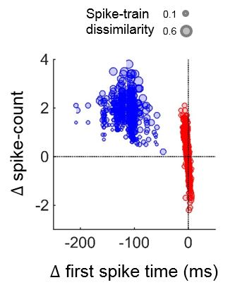
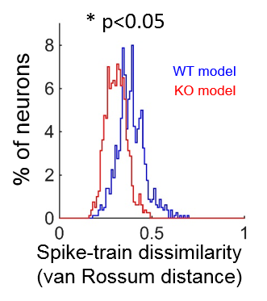

### Distorted Ex/In dynamics and pattern classification in a spiking network model of _Fmr1-KO_ cortical layer IV
---

This MATLAB code accompanies the following paper: 

Domanski APF, Booker S, Wyllie DJA, Isaac JTR, Kind PC (2019)
"_Cellular and Synaptic Compensations Limit Circuit Disruption in Fmr1-KO Mouse but Fail to Prevent Deficits in Information Processing_"

Nature Communications 2019 Oct 23;10(1):4814. 

DOI: 10.1038/s41467-019-12736-y

Author: Aleksander PF Domanski 2015-2019 University of Bristol, UK aleks.domanski@bristol.ac.uk

Copyright: (C) Aleksander PF Domanski 2019 University of Bristol, UK

## License: 
GNU General Public License version 2
This program is free software; you can redistribute it and/or modify it under the terms of the GNU General Public License as published by the Free Software Foundation; either version 2 of the License, or (at your option) any later version.
This program is distributed in the hope that it will be useful, but WITHOUT ANY WARRANTY; without even the implied warranty of MERCHANTABILITY or FITNESS FOR A PARTICULAR PURPOSE.  See the GNU General Public License for more details.
You should have received a copy of the GNU General Public License along with this program; if not, write to the Free Software Foundation, Inc., 59 Temple Place, Suite 330, Boston, MA  02111-1307  USA
http://www.gnu.org/copyleft/gpl.html

## Usage:
This code builds a spiking network model of early postnatal _Fmr1-KO_ cortical layer 4, provides stimulation and analyses single cell and population output.

Some features of this model:
- Leaky Integrate-and-Fire model neurons with Conductance-based synapses and realistic intrinsic properties:

- Sparse, random connectivity between Ex and In neurons:

- Realistic short-term depression at all synapses:

- _All_ parameters tuned by experimental results from the above paper:

---

## Core functions:

### `L4sim_DesignNetwork.m`

This function builds intrinsic parameters and a synaptic connectivity matrix for a recurrent spiking neural network with external stimulation and synapse-specific short-term plasticity.

### `L4sim_RunModel.m`

This function runs a conductance-based spiking network simulation using predefined parameters for network connectivity and synapses. Choice between leaky I&F and Izhikevich model neurons can be selected, short-term plasticity can be in/excluded and in-the-loop plotting can be configured based on input arguement switches.

###  `L4sim_MakePulseInput.m`

This function specifies the simulation parameters and builds the external pulse input structure for the thalamocortical pulse-response simulation. Stimulation parameters are specified as independently tunable rhythmic Dirac deltas to each of the Ex and In pools.

### `L4sim_Analyse.m`

This function analyses sigle-trial simulation results and extracts statistics on Excitation/Inhibition balance in the network pool:
- Population Ex/In balance:  Fraction of firing cells and smoothed spike density functions for each pool. 
- Single cell Ex/In balance: Balance in input currents. 
- Correlation between In and Ex firing pools
- Power spectral density LFP is simulated by taking multi-taper estimates of low-pass filtered summed input currents.
- Summary stats on spike time and rate

### `L4sim_PlotResults.m`

This function plots results of a single model trial:
- Spike rasters and smoothed spike density plots
- Simulated membrane potential and power spectra/spectrograms
- Synaptic currents 
- Measures of Excitation/Inhibition
- Single cell firing summary stats

N.B. frequency-domain analysis requires the Chronux toolbox, redistributed under the GNU  General Public License ver.2
http://chronux.org/forum/ and "Observed Brain Dynamics", Partha Mitra and Hemant Bokil, Oxford University Press, New York, 2008.

---

## Experiment 1) Test intrinsic tuning and connections

- Recapitulates Figure S6

### `Example_CurrentSteps.m`

Plots a simulated single-cell response to injected current (F-I plot):

### `Example_STP.m`

Plots example short-term plastic behaviour of synapses in response to repetitive stimulation:

## Experiment 2) Simulated Frequency response of Layer 4 network to patterned thalamocortical activity 

- Recapitulates Figure 9

- Run with `L4sim_RunFullModelLoop.m` and `L4sim_RunMultiTrialLoop.m`
- Analyse with `L4sim_metaAnalyseGroupData_FiringRate.m` and `L4sim_metaAnalyseGroupData_ExInBalance.m`

---

## Experiment 3) Examine thalamocortical pattern classification performance

- Recapitulates Figure 10

- Generate input pattern distractor sequences with `L4sim_MakeDistractorInput.m`

### Single cell classification performance

 

- Run with `L4Sim_ExamplePatternSeparation.m`

This script recapitulates the simulation analysis results for Fig 10A-C in the linked paper.
This code plots example spike trains from single units in response to inputs with/without added distractors.
Quantification of spike train modulation (change in rate, first spike time) is provided, as well as through a spike train metric 
(van Rossum MC, Neural computation 2001 Apr;13(4):751-63)

This code uses an optimised implementation of the van Rossum distance (Haughton C, Kreuz T, Network. 2012;23(1-2):48-58.). This dependency function is available online: provided (MATLAB) by Thomas Kreuz at: http://wwwold.fi.isc.cnr.it/users/thomas.kreuz/Source-Code/VanRossum.html 
and (C++) by Conor Haughton at:
https://sourceforge.net/p/spikemetrics/code/ci/default/tree/

### Population level classification performance

- Run with `L4sim_RunMultiPatternLoop.m`

- Analyse with `metaAnalyseDistractors_ClassificationAccuracyVsNoUnits.m`

- Spike trains from distractor stimulation trials are compared againt those from the reference condition using a multivariate population decoder.

- Trials are iteratively withheld and the performance of classifiers trainied on the remaining N-1 trials is evaluated in successfully determining the presence/absence of the distractor in the witheld trial.
- Population information content is then compared between genotypes as a function of the size of randomly drawn pools (ensembles) of neurons used for classification.

---

